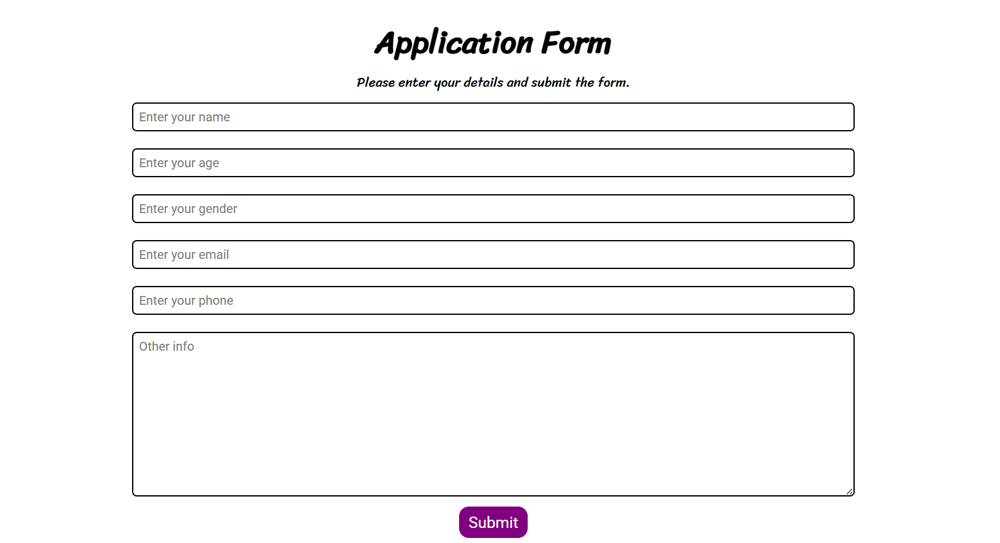
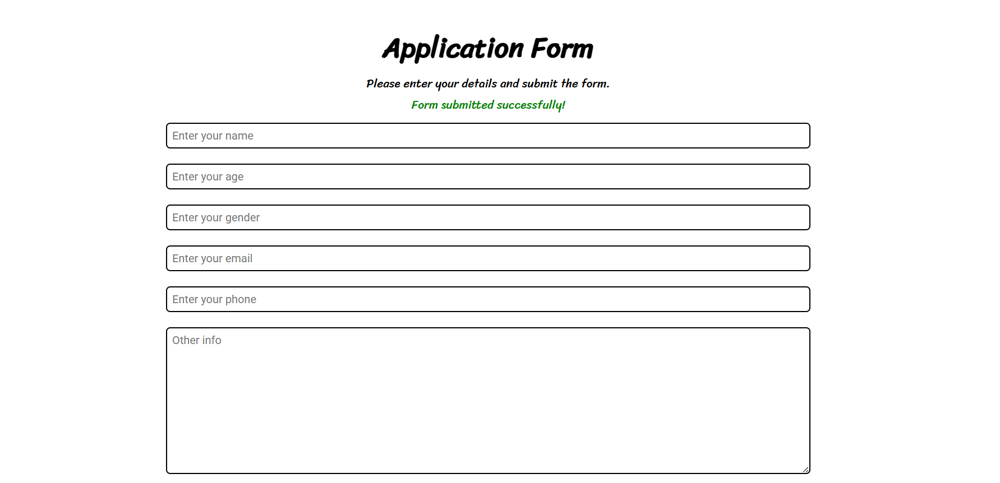
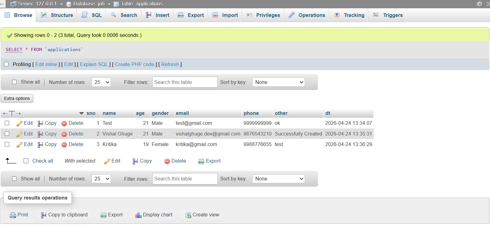

# PHP MySQL Application Form

A backend-focused form handling project built to practice secure data handling using PHP and MySQL.
## Features

- HTML form submission handled via PHP
- Secure data storage using prepared statements (prevents SQL injection)
- Input validation (required fields and email format)
- Duplicate email prevention via a `UNIQUE` database constraint
- Clear success and error feedback for the user
## Tech Stack

- PHP
- MySQL (via XAMPP / phpMyAdmin)
- HTML & CSS
## Project Structure

```
02-forms-db/
├── index.php      # Form UI, validation logic, and database operations
├── style.css      # Basic form styling
└── README.md      # Project documentation
```
## How It Works

1. User fills out the form (name, age, gender, email, phone, other info)
2. On submit, a POST request is sent to `index.php`
3. PHP validates the input (checks required fields and email format)
4. If valid, a prepared statement inserts the data into the `applications` table
5. If the email already exists, a duplicate error is shown
6. On success, a confirmation message is displayed to the user
## Screenshots

### 1. Empty Form
*The application form as seen by a new user.*



---

### 2. Successful Submission
*Confirmation message after a valid form submission.*



---

### 3. Database Entry (phpMyAdmin)
*Submitted data stored in the `applications` table.*



---
## Setup Instructions

### 1. Install XAMPP
Download from [https://www.apachefriends.org/](https://www.apachefriends.org/) and install.

### 2. Start Services
Open the XAMPP Control Panel and start **Apache** and **MySQL**.

### 3. Set Up the Database
- Go to [http://localhost/phpmyadmin](http://localhost/phpmyadmin)
- Create a database (e.g., `application_form`)
- Create an `applications` table with the following columns:

| Column   | Type         | Notes                  |
|----------|--------------|------------------------|
| id       | INT          | Primary key, auto increment |
| name     | VARCHAR(100) |                        |
| age      | INT          |                        |
| gender   | VARCHAR(20)  |                        |
| email    | VARCHAR(100) | UNIQUE constraint      |
| phone    | VARCHAR(20)  |                        |
| other    | TEXT         |                        |
| dt       | DATETIME     | Filled by `NOW()`      |

### 4. Run the Project
- Place the project folder inside `htdocs`:
  ```
  C:/xampp/htdocs/php-foundations/02-forms-db/
  ```
- Open in browser:
  ```
  http://localhost/php-foundations/02-forms-db/index.php
  ```
## Key Learnings

- Connecting PHP to MySQL using MySQLi
- Using prepared statements to prevent SQL injection
- Validating and sanitizing user input before database insertion
- Enforcing data integrity with a `UNIQUE` constraint on email
## Future Improvements

- UI enhancements
- Separate backend logic
- Production deployment
# rtCamp Associate Software Engineer — Application Form

A PHP + MySQL project built as part of my backend foundations practice. Users submit an application form, and the data is securely stored in a MySQL database.

---

## Features

- HTML form submission handled via PHP
- Secure data storage using prepared statements (prevents SQL injection)
- Input validation — required fields and email format check
- Duplicate email prevention via a `UNIQUE` database constraint
- Clear success and error feedback for the user

---

## Tech Stack

- PHP
- MySQL (via XAMPP / phpMyAdmin)
- HTML & CSS

---

## Project Structure

```
02-forms-db/
├── index.php      # Form UI, validation logic, and database operations
├── style.css      # Basic form styling
└── README.md      # Project documentation
```

---

## How It Works

1. User fills out the form (name, age, gender, email, phone, other info)
2. On submit, a POST request is sent to `index.php`
3. PHP validates the input (checks required fields and email format)
4. If valid, a prepared statement inserts the data into the `applications` table
5. If the email already exists, a duplicate error is shown
6. On success, a confirmation message is displayed to the user

---

## Screenshots

### 1. Empty Form
*The application form as seen by a new user.*


---

### 2. Successful Submission
*Confirmation message after a valid form submission.*


---

### 3. Database Entry (phpMyAdmin)
*Submitted data stored in the `applications` table.*


---

## Setup Instructions

### 1. Install XAMPP
Download from [https://www.apachefriends.org/](https://www.apachefriends.org/) and install.

### 2. Start Services
Open the XAMPP Control Panel and start **Apache** and **MySQL**.

### 3. Set Up the Database
- Go to [http://localhost/phpmyadmin](http://localhost/phpmyadmin)
- Create a database named `rtcamp`
- Create an `applications` table with the following columns:

| Column   | Type         | Notes                  |
|----------|--------------|------------------------|
| id       | INT          | Primary key, auto increment |
| name     | VARCHAR(100) |                        |
| age      | INT          |                        |
| gender   | VARCHAR(20)  |                        |
| email    | VARCHAR(100) | UNIQUE constraint      |
| phone    | VARCHAR(20)  |                        |
| other    | TEXT         |                        |
| dt       | DATETIME     | Filled by `NOW()`      |

### 4. Run the Project
- Place the project folder inside `htdocs`:
  ```
  C:/xampp/htdocs/php-foundations/02-forms-db/
  ```
- Open in browser:
  ```
  http://localhost/php-foundations/02-forms-db/index.php
  ```

---

## Key Learnings

- Connecting PHP to MySQL using MySQLi
- Using prepared statements to prevent SQL injection
- Validating and sanitizing user input before database insertion
- Enforcing data integrity with a `UNIQUE` constraint on email